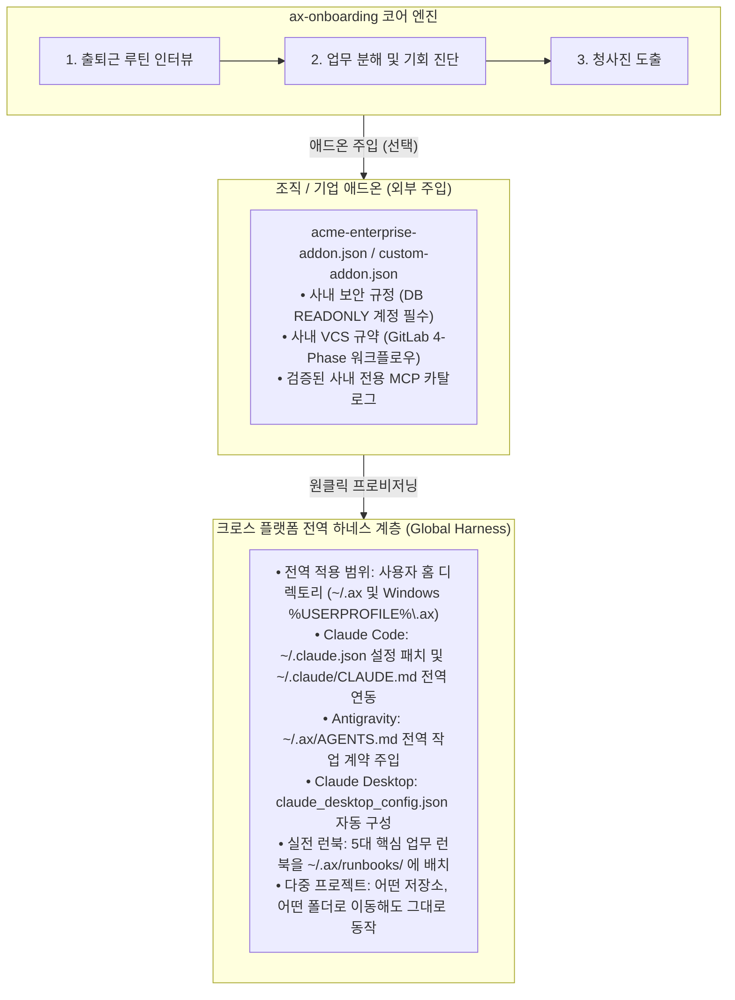

# Universal AX Onboarding (`ax-onboarding`)

[English](README.md) | [한국어](README.ko.md)

> "개인의 일상 업무가 먼저 디지털화(DX)되고 AI와 맞물리지(AX) 않은 상태에서, 결과물에만 AI를 억지로 붙이려는 시도는 밑 빠진 독에 물 붓기입니다."

출근해서 모니터를 켠 순간부터 퇴근할 때까지 반복하는 일상 업무를 1:1 인터뷰로 짚어보고, 실제 내 손발이 되어줄 도구(MCP)와 스킬, 작업 규칙, 실전 런북을 PC 전역에 한 번에 세팅해 주는 오픈소스 온보딩 도구입니다.

[](LICENSE)
[](https://github.com/parkjangwon/ax-onboarding/actions/workflows/ci.yml)
[]()
[]()
[]()

---

> ⚠️ **필수 안내: 웹 브라우저 채팅(claude.ai, chatgpt.com)이 아닌 '로컬 에이전트'에서 사용하세요**  
> `ax-onboarding`은 내 컴퓨터의 실제 파일, 사내 네트워크/DB, 로컬 터미널을 조작할 수 있는 **로컬 에이전트 환경**을 구축하는 도구입니다.  
> 샌드박스로 격리된 웹 브라우저 창은 내 PC 환경을 제어할 수 없으므로, 아래와 같은 로컬 에이전트 환경에서 실행해 주세요:  
> - **비엔지니어 / 사무직 권장**: [Claude Desktop (클로드 데스크톱 앱)](https://claude.ai/download) (GUI 마우스 조작 환경)  
> - **엔지니어 / 터미널 사용자**: Claude Code (CLI), Codex, Cursor, Windsurf  
> - **통합 에이전틱 IDE**: Google Antigravity, VS Code 에이전트 확장

---

## 왜 만들었는가

많은 조직이 AI 전환을 시도하지만 대부분 겉핥기에 그칩니다. 이유는 단순합니다.

1. **보여주기식 탑다운 도입의 한계**: 실무자가 매일 다루는 로그 확인, 이슈 추적, 보고서 작성, 데이터 대조 같은 일상에서 AI를 손발처럼 부려본 경험이 없는데, 고객에게 내놓을 제품에만 AI를 얹으려 하니 겉도는 결과물만 나옵니다.
2. **막연한 거리감**: AI가 일하는 방식을 바꾼다는 말은 많지만, 정작 아침에 출근해서 내 자리에 앉았을 때 당장 무엇부터 시켜야 할지 구체적인 가이드가 없습니다.
3. **설치와 보안의 장벽**: 외부 시스템을 연결하는 MCP(Model Context Protocol) 설정, 안전한 DB 읽기 전용(READONLY) 계정 발급, 실수 없는 작업 규칙(`CLAUDE.md`, `AGENTS.md`) 작성을 실무자가 일일이 챙기기는 쉽지 않습니다.

`ax-onboarding`은 프롬프트 몇 개 추천하고 끝나는 도구가 아닙니다. 출퇴근 일과를 세부 과업 단위로 분해한 뒤, 오픈 생태계(`skills.sh`, `Smithery.ai`)에서 꼭 필요한 도구를 찾아 사용자 홈 디렉토리에 바로 쓸 수 있는 상태로 갖춰줍니다.

---

## 시스템 구조

핵심 엔진은 100% 오픈소스이며 특정 회사에 종속되지 않습니다. 회사나 팀 고유의 보안 수칙, 사내 GitLab 주소, 전용 플러그인 등은 **애드온(Addon)** 설정 파일 하나로 덧붙여 주입합니다.



---

## 지원 직군 (Role Archetypes)

개발자만을 위한 도구가 아닙니다. 컴퓨터 앞에 앉아 데이터를 다루고 반복 작업을 하는 모든 직무를 지원합니다.

| 직군 | 대상 업무 예시 | 주요 에이전틱 전환 영역 |
|---|---|---|
| **소프트웨어 / DevOps** | 백엔드, 프론트엔드, 인프라, QA | 장애 로그 추적, 읽기 전용 DB 기반 트러블슈팅, 하위 호환성을 지키는 안전한 패치, 사내 GitLab 4-Phase MR 작성 |
| **비즈니스 / 사무** | 기획, 마케팅, 인사, 회계, 총무 | 여러 엑셀 시트 교차 대조 및 이상치 추출, 매일 아침 경쟁사 동향 브리핑, 회의 메모 기반 액션 아이템 정리 |
| **이커머스 / 소상공인** | 온라인 쇼핑몰, 스마트스토어, 셀러 | 다채널 주문 발주서 통합, 택배사 송장 양식 일괄 변환, 고객 리뷰 맞춤형 답변 초안 작성 |
| **요식업 / 셰프** | 레스토랑, 카페 운영자 | 식자재 시세 변동을 반영한 메뉴 원가율 산출, 예약 인원 기반 당일 발주량 계산, 주방 비치용 1장 조리 표준(SOP) |
| **일반 직무** | 프리랜서, 1인 창업가, 범용 사무직 | 직무 상관없이 1:1 문진을 통한 일상 루틴 맞춤형 자동화 |

---

## 실시간 도구 탐색 (두뇌와 사지의 결합)

수많은 분야의 도구를 미리 다 만들어 둘 필요가 없습니다. 인터뷰에서 파악한 업무 키워드를 토대로 검증된 외부 생태계를 직접 검색합니다.

- **스킬 탐색 (`skills.sh`)**: `npx skills find`를 통해 글로벌 커뮤니티에서 많은 사용자가 검증한 프롬프트 가이드와 워크플로우를 찾습니다.
- **MCP 탐색 (`Smithery.ai`)**: `@smithery/cli mcp search`를 통해 DB, SSH, S3, 브라우저 조작 등 실제 손발이 되어줄 도구를 찾습니다.

---

## 설치 즉시 제공되는 실전 런북 5종 (`runbooks/`)

온보딩을 마치면 사용자 홈 디렉토리(`~/.ax/runbooks/`)에 5대 실무 런북이 설치됩니다.
**명령어(/command)나 파일 경로(@runbooks/...)를 외울 필요가 전혀 없습니다.** 평소 동료에게 말하듯 일상어로 편하게 이야기하면, 에이전트가 백그라운드에서 의도를 파악하여 적절한 런북과 도구를 스스로 가동합니다.

1. `01-troubleshoot.md`: SSH 로그 조회부터 코드 라인 특정, 방어 패치 제안까지 이어지는 표준 장애 분석 런북
2. `02-customer-inquiry.md`: 고객 문의 인입 시 버그 재현 및 공식 회신 보고서(현상-원인-조치방안) 작성 런북
3. `03-safe-patch.md`: 기존 구조를 깨지 않고 하위 호환성을 지키며 안전하게 패치 브랜치를 만들고 MR을 올리는 런북
4. `04-browser-e2e.md`: Playwright 브라우저를 직접 띄워 화면 결함을 재현하고 콘솔 오류를 캡처하는 런북
5. `05-security-audit.md`: 배포 전 하드코딩된 시크릿, 개인정보(PII) 평문 출력, OWASP 취약점을 점검하는 보안 런북

> 💬 **사용자**: "어제 15시에 배치 돌다가 에러 났다는데 왜 그런지 좀 찾아줘."  
> 🤖 **에이전트**: *(명령어 없이도 백그라운드에서 자동으로 `01-troubleshoot.md` 런북과 SSH 도구를 연계하여 로그 추적 ➔ 원인 분석 ➔ 코드 패치 제안까지 일괄 수행)*

---

## 보안 및 권한 격리

- **DB 읽기 전용(READONLY) 강제**: `root`, `admin`, `sa` 같은 관리자 계정 입력을 차단하고, 반드시 `GRANT SELECT`만 부여된 계정을 쓰도록 유도합니다.
- **자격 증명 파일 격리 (`.env.mcp`)**: 민감한 접속 정보는 Git 저장소가 아닌 홈 디렉토리(`~/.ax/.env.mcp`)에 `chmod 600` 권한으로 따로 보관합니다. 실수로 커밋될 위험을 사전에 차단합니다.
- **위험 명령어 안전장치**: `rm -rf`, `drop database`, `reboot` 같은 파괴적인 명령은 사용자 승인 없이 실행하지 못하도록 작업 규칙에 명시합니다.

---

## 원라인 설치 및 클린 삭제

### 원라인 설치
터미널에서 명령어 한 줄만 실행하면 환경 점검부터 전역 세팅까지 인터랙티브하게 진행됩니다.

**macOS / Linux**:
```bash
curl -fsSL https://raw.githubusercontent.com/parkjangwon/ax-onboarding/master/scripts/install.sh | bash
```

**Windows (PowerShell)**:
```powershell
irm https://raw.githubusercontent.com/parkjangwon/ax-onboarding/master/scripts/install.ps1 | iex
```

### 원라인 클린 삭제
사용해 보고 마음에 들지 않으면 언제든 시스템을 처음 상태로 깨끗하게 되돌릴 수 있습니다. 쓰레기 파일을 남기지 않습니다.

**macOS / Linux**:
```bash
curl -fsSL https://raw.githubusercontent.com/parkjangwon/ax-onboarding/master/scripts/uninstall.sh | bash
```

**Windows (PowerShell)**:
```powershell
irm https://raw.githubusercontent.com/parkjangwon/ax-onboarding/master/scripts/uninstall.ps1 | iex
```

- 최신 타임스탬프 백업으로 원본 `~/.claude.json` 무손실 복구
- `~/.claude/CLAUDE.md`에서 온보딩 관련 연결 줄만 안전하게 제거 (기존 개인 규칙은 그대로 유지)
- ax-onboarding이 만든 파일만 제거 (`~/.ax` 내 런북·인증 정보·엔진 캐시) — **사용자가 직접 넣은 `~/.ax` 커스텀 파일은 보존**

---

## 다른 사용 방식

### 로컬 터미널 위저드
```bash
bun start            # 또는 npm start
bun start --rollback # 설정 원상복구
```

### 에이전트 대화창에 직접 요청 (`SKILL.md`)
Claude Desktop, Cursor, Antigravity 등 에이전트 채팅창에 저장소 주소만 건네면 됩니다.
> "https://github.com/parkjangwon/ax-onboarding 읽고 내 업무에 맞게 AX 세팅해줘."

에이전트가 `SKILL.md`를 읽고 대화창 안에서 직접 1:1 인터뷰를 시작합니다.

---

## 테스트

```bash
bun test
```
- 직군 매칭 및 키워드 라우팅
- 기업 애드온 스키마 검증
- 실시간 스킬 및 MCP 검색 파서
- DB 관리자 계정 차단 및 0600 권한 격리
- 실전 런북 생성 및 가동 점검
- 롤백 복구 무결성
- 크로스 플랫폼 경로 지원

*(14개 단위 테스트 통과)*

---

## 라이선스

MIT License © 2026 parkjangwon <vim@kakao.com>
