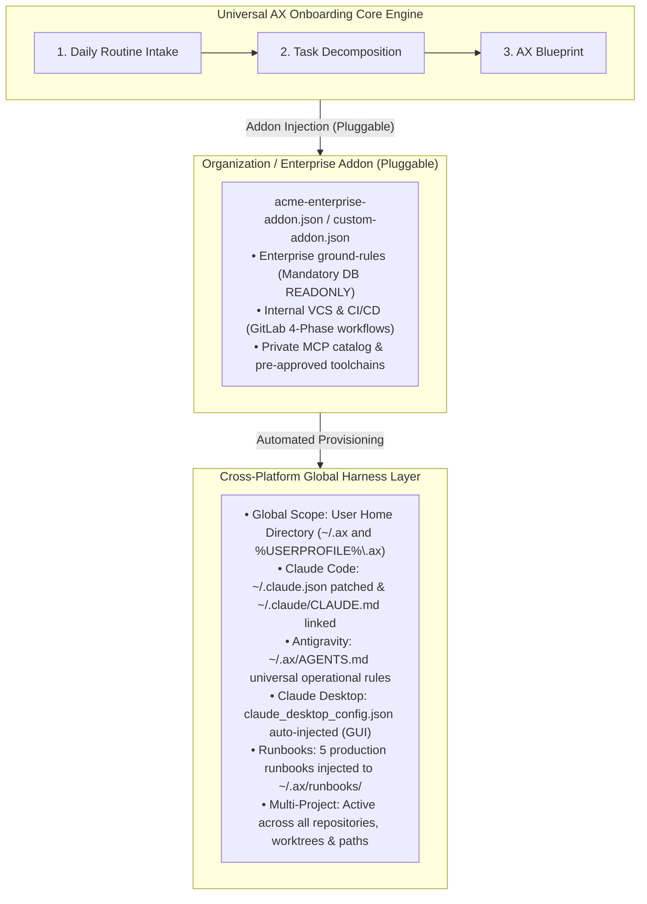

# 🚀 Universal AX Onboarding Framework (`ax-onboarding`)

[English](README.md) | [한국어](README.ko.md)

> **"Attempting to graft AI onto business deliverables without first transforming an individual's day-to-day work routines (AX preceded by DX) is a house built on sand."**  
> An enterprise-grade, agent-agnostic onboarding framework that decomposes your daily commute-to-leave routines through interactive diagnosis, and provisions a production-ready agentic harness (MCPs, community skills, security rules, and executable runbooks) with a single click.

[](LICENSE)
[]()
[]()
[]()

---

## 📌 Why `ax-onboarding`?

Across the tech industry, enterprise AI transformation (AX) initiatives consistently fail for three fundamental reasons:

1. **The Trap of "Top-Down AI Showing"**: Organizations push for AI-powered features in customer-facing products while their internal staff have never experienced continuous, natural AI collaboration in their own daily work (issue triaging, log analysis, report drafting, data reconciliation).
2. **The Abstraction Wall**: Employees hear that "AI is revolutionary," but nobody shows them how it applies to *what they do immediately after turning on their monitors at 9 AM*.
3. **The Setup & Security Barrier**: Connecting Model Context Protocol (MCP) servers, managing sensitive credentials, configuring strict database read-only gates, and writing robust execution contracts (`CLAUDE.md` / `AGENTS.md`) is too complex for most practitioners.

`ax-onboarding` bridges this gap. It acts as an **Agentic Harness Factory**: it conducts a structured 1:1 interview of your daily commute-to-leave routine, generates a tangible Before-vs-After AX Blueprint, dynamically pulls verified tools from `skills.sh` and `Smithery.ai`, and provisions a rock-solid, cross-platform global harness.

---

## 🏗️ Architecture

The core engine is **100% open source and organization-agnostic**. Company-specific guidelines, internal GitLab remotes, proprietary plugins, and strict compliance rules are injected externally via **Pluggable Addons**.



---

## 👥 Supported Role Archetypes

Not limited to software engineers. `ax-onboarding` supports anyone who works with data, computers, and recurring tasks:

| Archetype | Target Roles | Core AX Scope |
|---|---|---|
| **Tech Engineer** | Backend, Frontend, DevOps, SRE, QA | Incident log & stack-trace tracing, READONLY DB inspection, safe backward-compatible patches, GitLab 4-Phase MR workflows |
| **Business Office** | PM, Marketing, HR, Finance, Operations | Multi-sheet Excel diffing & anomaly detection, 8:30 AM automated competitor briefing, meeting-notes-to-action-item synthesis |
| **Commerce Merchant** | E-commerce sellers, SmartStore, Coupang | Multi-channel order sheet merging, courier invoice formatting, customer review sentiment analysis & polite response drafting |
| **Culinary & F&B** | Restaurant chefs, Cafe operators, F&B managers | Real-time ingredient cost & recipe margin recalculation, weather/reservation-based daily prep orders, kitchen 1-page standard SOPs |
| **General** | Freelancers, creators, general practitioners | Custom 1:1 questionnaire-based routine automation |

---

## 🦾 Dynamic Dual Discovery (Brain + Limbs)

To avoid hardcoding thousands of specialized domain tools:
- **🧠 Brain (Skills)**: Queries `skills.sh` (`npx skills find`) to find high-install community guides, review skills, and workflow templates.
- **🦾 Limbs (MCP Servers)**: Queries `Smithery.ai` (`@smithery/cli mcp search`) to discover real external tools (DB connectors, SSH shells, browser automation, S3, Slack).

---

## 📚 5 Production Runbooks Injected (`runbooks/`)

During setup, executable markdown runbooks are generated directly in your global home (`~/.ax/runbooks/`):

1. `01-troubleshoot.md`: Step-by-step incident response from SSH logs to code line pinpointing and non-breaking patch proposals.
2. `02-customer-inquiry.md`: Bug reproduction and generation of formal 3-tier customer feedback reports (*Symptoms - Root Cause - Resolution*).
3. `03-safe-patch.md`: Conservative bug fixing respecting backward compatibility and team VCS branch/MR conventions.
4. `04-browser-e2e.md`: Headless/visual browser automation with Playwright to capture console errors and UI regressions.
5. `05-security-audit.md`: Pre-commit static audit for hardcoded secrets, OWASP vulnerabilities, and plaintext PII logging.

Users trigger them naturally:
> `👉 @~/.ax/runbooks/01-troubleshoot.md Investigate the 3 PM batch failure`

---

## 🛡️ Enterprise-Grade Security & Isolation

- **Mandatory DB READONLY Gate**: Rejects administrator accounts (`root`, `admin`, `sa`). Requires a dedicated read-only database user (`GRANT SELECT`).
- **Zero-Leak Credential Storage**: Sensitive credentials are saved to `~/.ax/.env.mcp` with strict `chmod 600` permissions and automatically appended to `.gitignore`. No secrets are ever committed.
- **Guarded Commands**: Prohibits destructive commands (`rm -rf`, `drop database`, `reboot`) without explicit interactive user approval.

---

## ⚡ One-Line Install & Clean Uninstall

### 📥 One-Line Install
Run in your terminal to begin the interactive diagnosis and global harness setup:

**macOS / Linux**:
```bash
curl -fsSL https://raw.githubusercontent.com/acme/ax-onboarding/master/scripts/install.sh | bash
```

**Windows (PowerShell)**:
```powershell
irm https://raw.githubusercontent.com/acme/ax-onboarding/master/scripts/install.ps1 | iex
```

### 🧹 One-Line Clean Uninstall
Restores your system to a pristine, 100% untouched state without leaving a single orphaned byte:

**macOS / Linux**:
```bash
curl -fsSL https://raw.githubusercontent.com/acme/ax-onboarding/master/scripts/uninstall.sh | bash
```

**Windows (PowerShell)**:
```powershell
irm https://raw.githubusercontent.com/acme/ax-onboarding/master/scripts/uninstall.ps1 | iex
```

> **Clean Uninstall Guarantee:**
> - Lossless restoration of `~/.claude.json` from backup.
> - Preserves 100% of existing user rules in `~/.claude/CLAUDE.md`, safely unlinking only the AX line.
> - Completely wipes `~/.ax` (runbooks, credentials, cache).

---

## 🚀 Alternative Usage Methods

### Method 1: Local CLI Wizard
```bash
bun start          # or: npm start
bun start --rollback # to clean up
```

### Method 2: Agent-Native (`SKILL.md` or GitHub URL)
Simply hand this repository URL to your AI agent (Claude Desktop, Cursor, Antigravity, ChatGPT):
> *"Read https://github.com/acme/ax-onboarding and onboard me to an agentic workflow."*

The agent parses `SKILL.md` and drives the 1:1 interview conversationally in chat.

---

## 🧪 Automated Tests

```bash
bun test
```
- Archetype matching & routing
- Enterprise Addon schema validation
- Live skill & MCP registry parsers
- Credential isolation & DB security validation
- Runbook injection, healthchecks, and rollback mechanics
- Cross-platform path resolution

*(14 unit tests, 100% passing)*

---

## 📄 License

MIT License © 2026 Park Jang-won (Acme)
